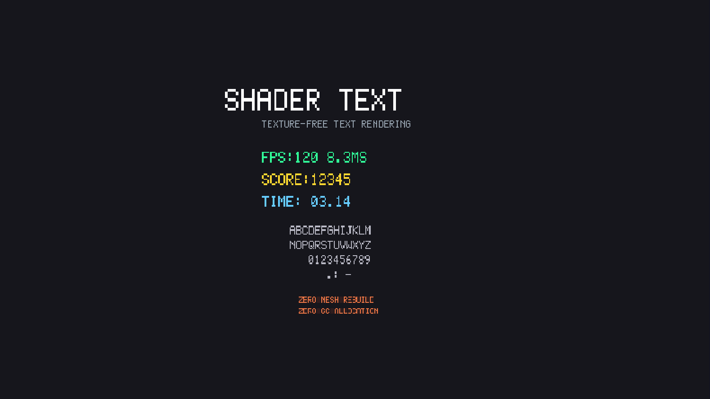

# Shader Text

[](https://unity.com/)
[](LICENSE)

Texture-free text rendering for Unity UI using in-shader bitmap fonts.
Designed for debug overlays with **zero mesh rebuild** on text updates.



## Features

- **Zero Mesh Rebuild** - Text updates only write to a GPU buffer. No vertex recalculation, no Canvas rebuild.
- **Texture-Free** - All glyphs are encoded as bit-packed data inside the shader. No font textures or atlases needed.
- **Unity UI Integration** - Extends `MaskableGraphic`. Works with Canvas layout, RectMask2D, and UI Mask.
- **Anti-Aliased** - Smooth edges via `smoothstep` with screen-space derivatives (`fwidth`).
- **Edit Mode Support** - `[ExecuteAlways]` allows preview in the Scene view without entering Play mode.

## Supported Characters

| Category | Characters |
|----------|-----------|
| Digits | `0 1 2 3 4 5 6 7 8 9` |
| Letters | `A B C D E F G H I J K L M N O P Q R S T U V W X Y Z` |
| Symbols | `(space)` `:` `.` `-` |

Lowercase letters are automatically mapped to uppercase.

## Requirements

- Unity 2021.3 or later
- Shader Model 4.5 (StructuredBuffer support)

## Installation

### Unity Package Manager (Git URL)

Open **Window > Package Manager**, click **+** > **Add package from git URL...**, and enter:

```
https://github.com/toguchi/ShaderText.git?path=Packages/com.toguchi.shadertext
```

### Manual

Clone or download this repository and copy the `Packages/com.toguchi.shadertext` folder into your project's `Packages/` directory.

## Quick Start

1. Create a **Canvas** in your scene (if you don't have one already).
2. Add an empty **GameObject** under the Canvas.
3. Add the **Shader Text Renderer** component (`Add Component > UI > Shader Text Renderer`).
4. Set the **Text** field in the Inspector.

### From Script

```csharp
using ShaderText;

var renderer = gameObject.AddComponent<ShaderTextRenderer>();
renderer.MaxCharacters = 16;
renderer.Text = "FPS:60 16.7MS";

// Updating text is extremely cheap — no mesh rebuild occurs
renderer.Text = "FPS:120 8.3MS";
```

## API Reference

### ShaderTextRenderer

Inherits from `UnityEngine.UI.MaskableGraphic`.

| Property | Type | Default | Description |
|----------|------|---------|-------------|
| `Text` | `string` | `""` | Display text. Only GPU buffer is updated on change. |
| `MaxCharacters` | `int` | `16` | Maximum number of characters. Determines buffer size. |
| `CharacterWidth` | `float` | `14` | Width of each character in pixels. |
| `CharacterHeight` | `float` | `24` | Height of each character in pixels. |
| `CharacterSpacing` | `float` | `2` | Horizontal gap between characters in pixels. |

| Method | Return | Description |
|--------|--------|-------------|
| `SetChar(int index, char c)` | `void` | Set a single character at the given slot. Does not upload to GPU. |
| `ClearChars(int startIndex = 0)` | `void` | Fill slots from `startIndex` onward with blank. |
| `Apply()` | `void` | Upload buffer changes to the GPU. |
| `WriteInt(int value, int startIndex = 0)` | `int` | Write an integer without string allocation. Returns characters written. |
| `WriteFloat(float value, int decimals, int startIndex = 0)` | `int` | Write a float without string allocation. Returns characters written. |
| `WriteString(string text, int startIndex = 0)` | `int` | Write each character of a string. Returns characters written. |

Standard `MaskableGraphic` properties (`color`, `raycastTarget`, etc.) are also available.

## Zero-GC Usage

The `Text` property accepts a `string`, which causes GC allocation when using `ToString()` or string interpolation every frame. For performance-critical scenarios (e.g., FPS counters updated every frame), use the zero-GC API instead:

```csharp
// ❌ Allocates strings every call (GC pressure)
renderer.Text = $"FPS:{fps} {ms:F1}MS";

// ✅ Zero-GC — writes directly to the GPU buffer
int pos = 0;
pos += renderer.WriteString("FPS:", pos);
pos += renderer.WriteInt(fpsValue, pos);
pos += renderer.WriteString(" ", pos);
pos += renderer.WriteFloat(msValue, 1, pos);
pos += renderer.WriteString("MS", pos);
renderer.ClearChars(pos);   // blank remaining slots
renderer.Apply();            // upload to GPU
```

### Pattern: SetChar + Apply

For single-character updates:

```csharp
renderer.SetChar(0, 'A');
renderer.SetChar(1, '1');
renderer.ClearChars(2);
renderer.Apply();
```

### Pattern: WriteInt + WriteFloat

`WriteInt` and `WriteFloat` return the number of characters written, making it easy to chain calls:

```csharp
int pos = 0;
pos += renderer.WriteInt(score, pos);      // e.g. "12345"
pos += renderer.WriteString(" ", pos);     // separator
pos += renderer.WriteFloat(time, 2, pos);  // e.g. "3.14"
renderer.ClearChars(pos);
renderer.Apply();
```

## How It Works

```
┌──────────────────────────────────────────────────────────┐
│  CPU (C#)                                                │
│  ┌─────────────┐    ┌──────────────────┐                 │
│  │ Text = "AB" │───>│ CharToIndex('A') │──> [10, 11]    │
│  └─────────────┘    │ CharToIndex('B') │                 │
│                     └──────────────────┘                 │
│                            │                             │
│                   GraphicsBuffer.SetData()               │
│                            │ (no mesh rebuild)           │
├────────────────────────────┼─────────────────────────────┤
│  GPU (Shader)              ▼                             │
│  ┌─────────────────────────────────────────────┐         │
│  │ StructuredBuffer<uint> _CharIndices          │         │
│  │                                              │         │
│  │ Fragment Shader:                             │         │
│  │   charIndex = _CharIndices[slotIndex]        │         │
│  │   pixel = SampleGlyph(charIndex, uv)         │         │
│  │   alpha = smoothstep(edge, pixel)            │         │
│  └─────────────────────────────────────────────┘         │
│                                                          │
│  Font Data: 5×7 bitmap, 35 bits per glyph (uint2)       │
└──────────────────────────────────────────────────────────┘
```

1. **CPU side** converts each character to a glyph index and writes the array to a `GraphicsBuffer`.
2. **GPU side** reads the index per character slot and samples from a hard-coded 5x7 bitmap font.
3. Anti-aliasing is applied using `smoothstep` with `fwidth`-derived edge thresholds.

## Samples

### Performance Counter

A real-time FPS and frame time display with zero GC allocation. Import via **Package Manager > Shader Text > Samples > Performance Counter**.

```csharp
// Output example: "FPS:120 8.3MS"  (zero GC allocation)
int pos = 0;
pos += _renderer.WriteString("FPS:", pos);
pos += _renderer.WriteInt((int)fps, pos);
pos += _renderer.WriteString(" ", pos);
pos += _renderer.WriteFloat(ms, 1, pos);
pos += _renderer.WriteString("MS", pos);
_renderer.ClearChars(pos);
_renderer.Apply();
```

## License

This project is licensed under the [MIT License](LICENSE).
